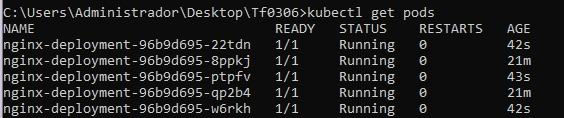
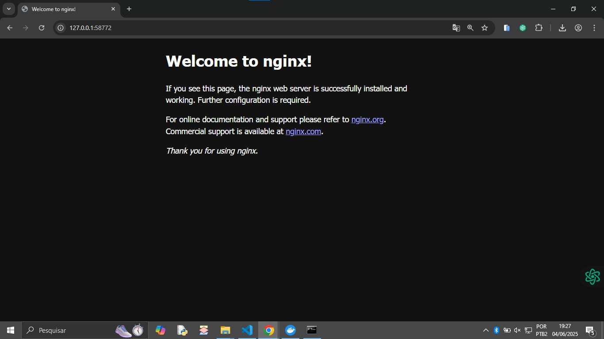

Kubernetes com Minikube: Deploy do Nginx

Este exercício realiza o deploy de um servidor Nginx em um cluster Kubernetes local com Minikube. Inclui a criação de um Deployment, exposição via NodePort, escalonamento de réplicas, acesso via navegador e limpeza do ambiente.

Pré-requisitos
Git

kubectl

Minikube

Instruções
Clone o repositório e entre na pasta:

git clone https://github.com/nicolashrq/TF_0206.git
cd TF_0206

Inicie o Minikube e verifique o cluster:

minikube start
kubectl cluster-info

Aplique os arquivos YAML:

kubectl apply -f nginx-deployment.yaml
kubectl apply -f nginx-service.yaml

Verifique os recursos:

kubectl get deployments
kubectl get pods
kubectl get services

Acesse a aplicação:

minikube service nginx-service --url

Abra a URL no navegador ou use curl.

(Tela do Nginx na pasta images/nginx-browser.png)

Escale para 5 réplicas:

Edite o arquivo nginx-deployment.yaml e altere para "replicas: 5".
Reaplique e verifique:

kubectl apply -f nginx-deployment.yaml
kubectl get pods

(Tela dos 5 pods em images/nginx-scaled-5-pods.png)

Reduza para 1 réplica:

Altere para "replicas: 1".
Reaplique e verifique:

kubectl apply -f nginx-deployment.yaml
kubectl get pods

Visualize os logs de um pod:

kubectl get pods
kubectl logs <nome-do-pod>

(Substitua <nome-do-pod> pelo nome real do pod)

Limpeza do ambiente:

kubectl delete -f nginx-service.yaml
kubectl delete -f nginx-deployment.yaml
kubectl get deployments
kubectl get services

Estrutura do projeto
nginx-deployment.yaml

nginx-service.yaml

README.md

imagens/

